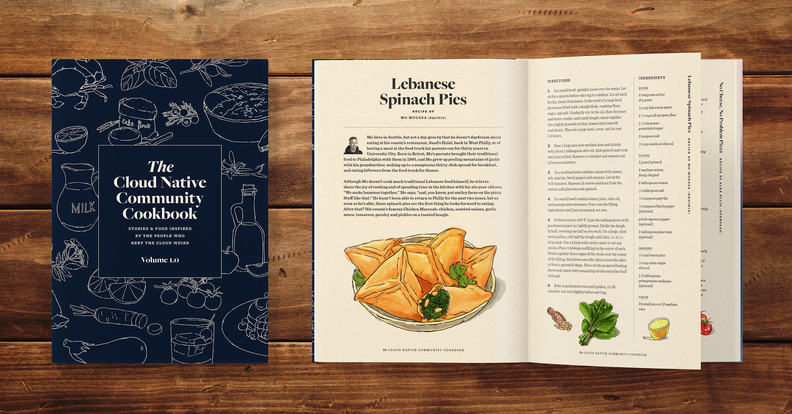

Welcome to **The Cloud Native Community Cookbook** repo! This is a special project cooked up from the hearts and minds at Equinix Metal. 

I’m not sure about your Slack communities, but at Metal, the #eats channel is one of our most popular channels (followed closely, of course, by #drinks). As COVID-19 spread across the world, our people found themselves increasingly connecting over the culinary experiments they were whipping up in the kitchen. Sourdough starter gone wrong, anyone? Before we knew it, the #eats channel was abuzz. It became a contest: Who could share the most mouthwatering photo? Which recipe would be the favorite of the day? Our people started to comment that we should publish a cookbook with all of our favorite go-to recipes. 

Well, go big or go home, right? We thought just a Metal cookbook wasn’t ambitious enough, so we decided to open it up to the entire Cloud Native Community. We wanted to extend the joy that we had captured in #eats to the rest of you. So without further ado, here is the start of The Cloud Native Community Cookbook. 

[The Cloud Native Community Cookbook \(pdf\)](https://origins.dev/assets/docs/Cloud-Native-Community-Cookbook-v1_2.pdf)

But this is just the beginning of our Community Cookbook project. We want to hear from more of you, the community! So how do you submit to the cookbook?

Think about it! What are your favorite mouth-watering recipes from the past year? What are the shining culinary stars or your daily cannot live withouts? Create a pull request and submit your recipe to this repo. Make sure you share the story behind the recipe! We want to know why you chose it and why it’s special to you or your family. 

In a few months, we’ll revisit this repo and reach out to those of you who have submitted recipes. Our goal is to have a beautiful and illustrated printed edition of this cookbook to share with you at the next KubeCon North America. We hope this cookbook will serve as a reminder of how we banded together as a community during covid and supported each other in our shared hardships. This hasn’t been an easy year, but we as a community have emerged from it stronger than ever. 
