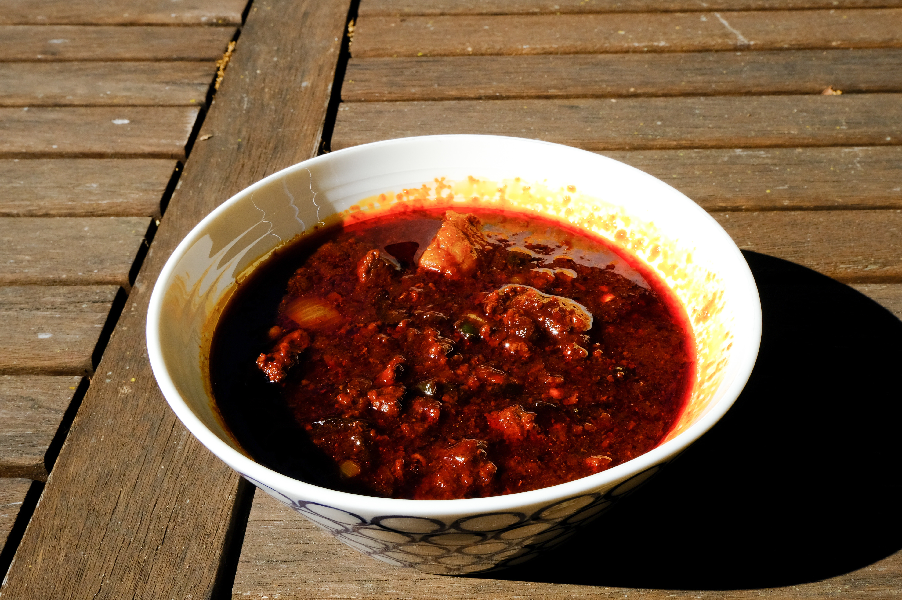

# Tim's Chili Recipe

## Background

Okay, look, I also hate the big long life stories with recipes so this is not that. But it is important to talk about chili a little bit. Chili has two main ingredients:

- meat

- heat

That's it. No beans. No corn. No goddamned tofu or any shit like that. 

_"oH bUt HoW wIlL yOu MaKe iT tHiCk?? tHaT's JuSt hOt DoG sAwSe!!"_

You use meat to make it thick. You use a combination of big chunks of meat and ground meat. You cook it a long time over low heat in chili purée. It becomes a spicy, hearty, meal with chunks of delicious, melt-in-your-mouth short rib suspended in a meat lava.

## Ingredients
- 2 sweet onions
- 5 cloves of garlic
- 3 poblano peppers
- 6 jalapeno peppers
- 3oz dried chipotle peppers
- 6oz dried ancho peppers
- 3oz dried guajillo peppers
- 1lb hot and spicy pork sausage
- 4lbs short ribs, cubed
- 3lbs 80/20 ground beef
- 1 quart beef stock
- 2Tb tomato paste
- 1Tb  worcestershire sauce
- 2Tb balsamic vinegar
- 2Tb balsamic reduction
- 2Tb vegetable oil
- 2Tb cumin
- Salt
- pepper

## Equipment

- Food mill, food processor, or immersion blender
- Chinois or sieve (if not using a food mill)
- 5qt stock pot
- 10qt stock pot

## Method

1. Put 8 cups of water in the 5qt stock pot, add in approximately 2 tablespoons of salt. Set heat to medium high and bring to a boil. 
2. Once water is boiling, put all the dried chiles into the pot, cover and turn down heat to medium-low. Remove from heat once chilis are soft, approximately 30 to 45 minutes. 
3. While chiles are steaming, dice onions, jalapenos and poblanos. 
4. In 10qt stock pot, heat 2 tablespoons of vegetable oil. Once oil shimmers, add in short ribs. As the short ribs brown, add in 1 tablespoon of cumin, and salt and pepper to taste. Remove short ribs from pot once browned and set aside. 
5. Knead together sausage and ground beef, then put in 10qt stock pot and brown. 
6. Remove the dried chiles from the water with tongs. Remove stems and put chiles into the food mill or food processor. Grind into a paste. If using a food processor or immersion blender, press the paste through a chinois or other sieve (even cheesecloth can do in a pinch).
7. Once ground beef and sausage is cooked, add onions, jalapenos, and poblanos. Turn heat down to medium low. Bring to a simmer and cover. 
8. After onions, jalapenos, and poblanos are softened, add short ribs and chili paste. Stir till well mixed.
9. Add in 1 tablespoon of worcestershire sauce along with 2 tablespoons of tomato paste, balsamic vinegar, and balsamic reduction and beef stock. Let reduce for 45 minutes to 3 hours (depending on how intense you like the flavor), stirring occasionally. 

_For thicker chili, add masa. For sweeter notes, add molasses_

